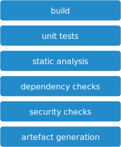

# build and unit tests

## Overview

This stage contains the classic application build.
It is enriched with further analysis and checks.

## Steps

1. code compilation and build
2. unit tests
3. static analysis
4. dependency checks
5. security checks
6. artefact generation

### code compilation and build

* build the code

Any build failure must stop the pipeline. This to provide fast feedback.

### unit tests

* run all unit tests
* collect test results
* collect test coverage

Failing unit tests will not stop the pipeline.

Any non passing test must change the status of this step to unstable.

Testing guidelines: [test pyramid](../../best-practices.md#testing)

### static analysis

* static code analysis
* Static Application Security Testing (SAST)

More details and tool suggestions: [static-analysis.md](static-analysis.md)

### dependency checks

* check dependencies for updates
* check dependencies for security problems
* license checks

More details and tool suggestions: [dependency-checks.md](dependency-checks.md)

### security checks

* Dynamic Application Security Testing (DAST)

More details and tool suggestions: [security-checks.md](security-checks.md)

### artefact generation

Packaging of the artefact.

## Stage Output

The output will be:

* application artifacts
* test results
